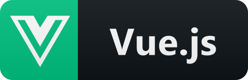
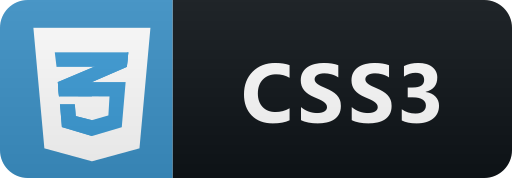

# Portafolio Personal 🚀
***Mi portafolio personal es una aplicación web dinámica y receptiva construida utilizando Vue.js, diseñada para presentar mi trabajo, habilidades y experiencia en el desarrollo web. Este proyecto se centra en proporcionar una experiencia de usuario fluida y atractiva.***

# Características Principales 💻 <br>
📍**Diseño Moderno y Atractivo:** Utilizando Vue.js, he creado componentes interactivos que hacen que la experiencia de navegación sea fluida y agradable. <br>
📍**Navbar Bottom en la Versión Móvil:** En la versión móvil de mi portafolio, he implementado una barra de navegación inferior para una navegación más accesible y cómoda en dispositivos móviles.  <br>
📍**Adaptabilidad y Responsividad:** Mi portafolio está diseñado para verse y funcionar bien en una variedad de dispositivos y tamaños de pantalla, desde computadoras de escritorio hasta dispositivos móviles.  <br>

# Demo:
**¡Phone 14 Plus** (428px x 926px)<br>
 <br>

**Galaxy Z Flip 3** (360px x 880px)<br>
 <br>
 
**Huawei P30 PRO** (360px x 780px) <br>
 <br>

**¡Pad Air 4** (820px x 1180px)<br>
 <br>

**Macbook Air** (1280px x 800px) <br>
 <br>

# Tecnologías Utilizadas 🛠️

*   
* 
* 
* 
* 

# Dependencias 📚
* [AOS Animate On Scroll Library](https://michalsnik.github.io/aos/)
* [typed-js](https://github.com/mattboldt/typed.js?tab=readme-ov-file)

# Ejecutando las pruebas ⚙️


# Instalación ⚙️
Clona el repositorio:
```
git clone https://github.com/M-VictoriaCM/Portfolio.git
```
Instala las dependencias
```
npm install
```
Iniciar el servidor
```
npm run dev
```

